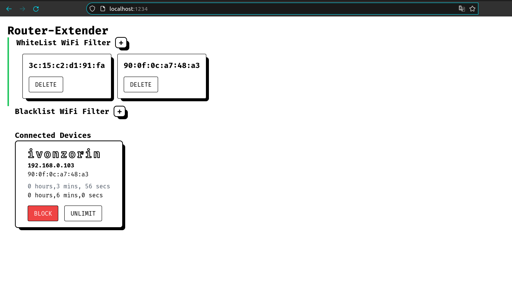
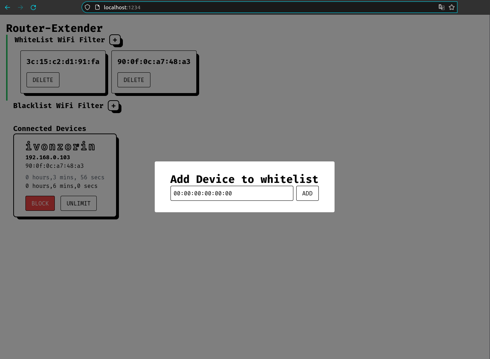
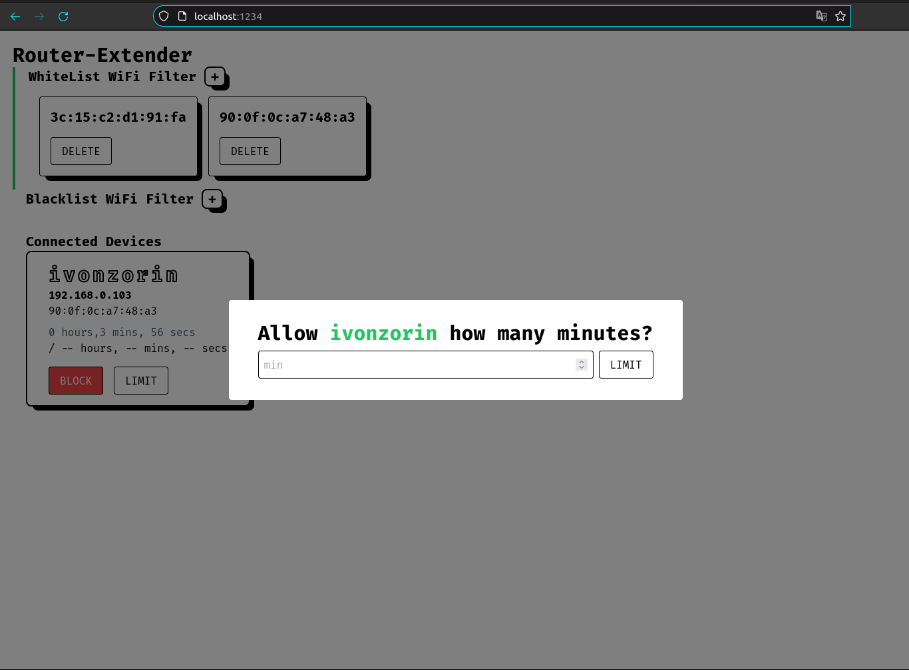

# VIDA Router-Extender
A simple HTML page and a NODEJS server to extend the functionality of a VIDA M2 Mobile Wifi Router.

### Technologies used
- [Web Components](https://developer.mozilla.org/en-US/docs/Web/Web_Components)
- [HTML5](https://developer.mozilla.org/en-US/docs/Glossary/HTML5), [CSS3](https://developer.mozilla.org/en-US/docs/Web/CSS) 
- [tailwindcss](https://tailwindcss.com/docs)
- [parcel](https://parceljs.org/)
- [express](https://expressjs.com/)

### Screenshots

